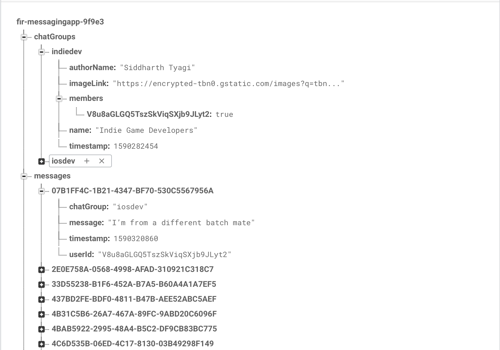
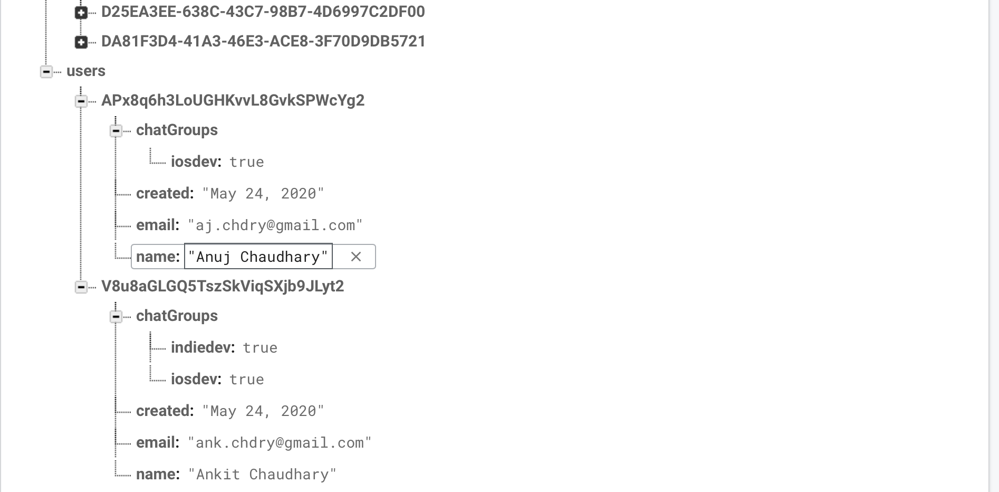
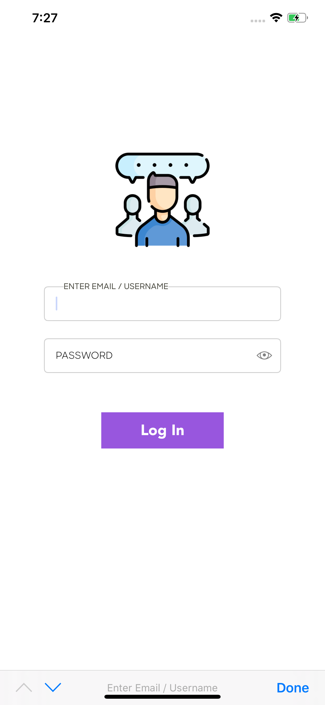
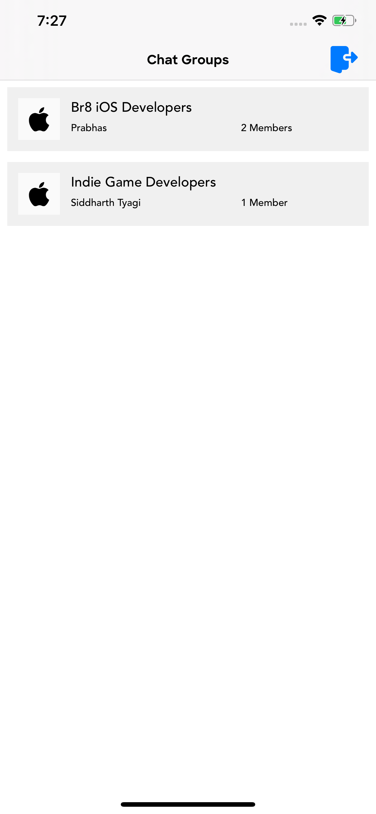
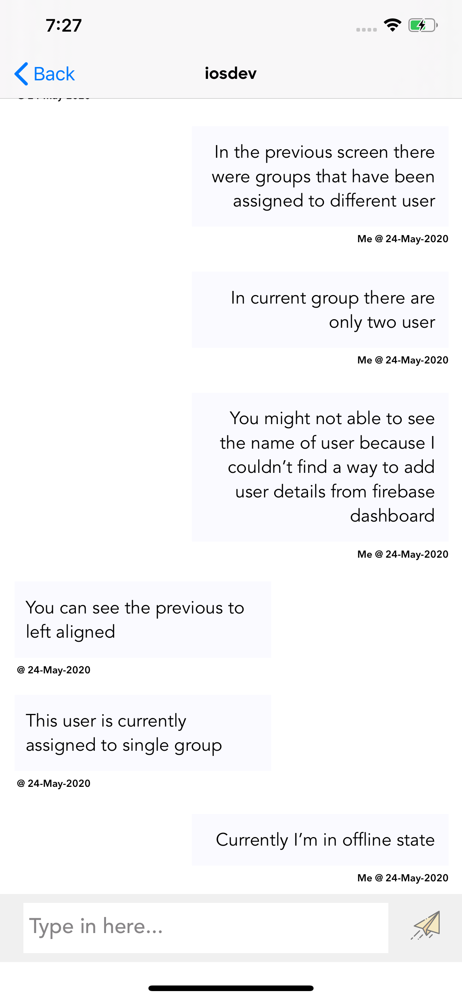

# FirebaseMessagingApp
This is an example chat application which consists of groups and associated users to them. Used firebase Realtime Database
to sync data with server and RxSwift with MVVM architecture. It provides offline support as well.

## Firebase Realtime Database - Backend JSON Structure 

## App Snapshots
<table>
  <tr>
    <th>
      
    </th>
    <th>
      
    </th>
    <th>
    
    </th>
  </tr>
</table>
